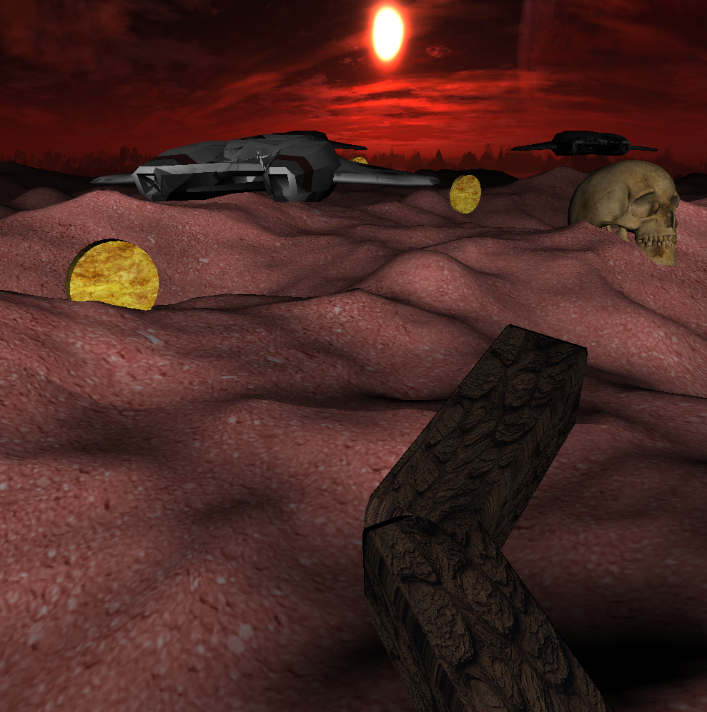

# Worm Rider
This repository is OpenGL project inspired by Dune novel. It is also an assignment for Computer Graphics and Visualization at Poznan University of Technology.

### Gameplay
The gameplay consists of moving a worm in an endless desert via the a, w, s and d keys. In addition, the player collects coins and must avoid enemies in the form of spaceships.

### Demo

